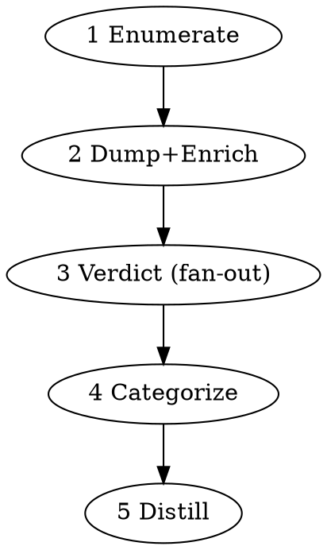

# Learn From PR Reviews

Turn a repository's entire pull-request review history into (a) a verified,
categorized **wisdom corpus** and (b) a **DRAFT** `review.md` checklist +
review-agent prompt. Built to seed the §3 "Review" core document in the
**llm-conventions** repo — `standard-artifacts/review.md`
(https://github.com/NASA-IMPACT/llm-conventions). See this repo's README for
how the two relate.

**Central principle:** a comment existing ≠ it was meaningful, and a comment
being made ≠ it was acted on. Every comment is judged against the *actual code*
(the code the reviewer saw + the diff of what changed afterward), so nits get
filtered out and "addressed / ignored / rejected" is decided from evidence.

## Inputs

- `<owner/repo>` — the GitHub repo (e.g. `NASA-IMPACT/MMGIS`).
- `<local-clone-path>` — a local clone of that repo (needed for code enrichment).
- `gh` must be authenticated (`gh auth status`).

Outputs land in `review-mining/<owner-repo>/` at the repo root (gitignored).

## The pipeline

Five phases with deliberately different cost profiles. **Phases 1–2 are pure
shell/`gh` — no LLM.** Phase 3 fans out small fast subagents. Phases 4–5 are
single synthesis passes by you (the orchestrator).



### Phase 1 — Enumerate (no LLM)

```bash
skills/learn-from-pr-reviews/scripts/enumerate-prs.sh <owner/repo>
```
Writes `01-prs.json` (all states — merged, closed, open). The fork boundary is
automatic: `gh pr list` against a fork returns only PRs opened in the fork.

### Phase 2 — Dump threads + code-context enrichment (no LLM)

Loop over every PR number (use a `read` loop — `for n in $(...)` does NOT split
on newlines under zsh):
```bash
jq -r '.[].number' review-mining/<owner-repo>/01-prs.json | while IFS= read -r n; do
  skills/learn-from-pr-reviews/scripts/fetch-pr-threads.sh <owner/repo> <local-clone-path> "$n"
done
```
Per PR this writes `02-threads/PR-<n>.json` — one self-contained record per
comment thread, covering all three sources (inline / review-summary /
issue-comment), thread resolution, and for inline comments the **code window the
reviewer saw** + the **post-comment delta** (what actually changed in that file
afterward). All sources are fetched with `--paginate`, so there are no comment
caps. The first invocation auto-detects which local remote points at the repo and
fetches PR refs into the clone once, so even closed-PR commits resolve.

### Phase 3 — Per-thread verdict (Workflow fan-out, Sonnet)

First, split the threads into one file per record (handles thousands; prints the
total COUNT):
```bash
COUNT=$(skills/learn-from-pr-reviews/scripts/split-threads.sh <owner/repo>)
```
Then invoke the **Workflow tool** (this skill's instruction is the opt-in) to run
one **Sonnet** subagent per record (the default; pass `args.model: "haiku"` to
trade accuracy for cost), using the template
`skills/learn-from-pr-reviews/scripts/phase3-verdict.workflow.js`. Each agent
reads its `03-input/rec-NNNNN.json`, decides `substantive`, `category`, and the
evidence-based `verdict` (using `post_comment_delta`, `renamed_to`, and the
`resolved` flag as the "acted on?" signals), and distills ONE generalizable
`lesson`. The verdict contract lives in `references/verdict-schema.json` (the
single source of truth) — read it and pass it as `args.schema`; the dimensions
are defined in `references/categories.md`. Sonnet is the default because it is
materially better calibrated than Haiku on ambiguous "addressed vs. ignored"
cases (it reaches for `unclear` instead of a confident wrong verdict).

**Batch the invocation.** A single workflow can spawn at most ~1000 agents over
its lifetime, so process the records in batches of ≤900: for `start` =
0, 900, 1800, … (while `start < COUNT`) invoke
```
Workflow({ scriptPath: ".../scripts/phase3-verdict.workflow.js",
           args: { dir: "<abs>/review-mining/<owner-repo>/03-input",
                   start: <start>, count: <min(900, COUNT-start)>,
                   schema: <parsed verdict-schema.json> } })
```
and **append** each returned array to `03-verdicts.jsonl` (one verdict per line).
If `COUNT ≤ 900` that's a single batch with `start: 0, count: COUNT`. The Workflow
tool always runs in the background — wait for each completion notification before
launching the next batch. After the last batch, confirm the line count of
`03-verdicts.jsonl` equals `COUNT` (no records silently lost).

### Phase 4 — Categorize → corpus (you, the orchestrator)

Read `03-verdicts.jsonl`. Keep `substantive: true`. Group by `category`
(the `review.md` dimensions + `emergent`). Write `04-corpus.md`:
- A header with totals: threads analyzed, substantive vs. discarded (report the
  discard count — **never drop silently**), confidence + code_context coverage.
- Per category: the deduped lessons, each with its PR link(s), how many times it
  recurred, and the **verdict mix** (a rule raised 5× and always addressed is
  stronger than one raised once and ignored).

### Phase 5 — Distill → DRAFT review artifact (you, the orchestrator)

Write `05-review-draft.md`:
- A `review.md`-style checklist grouped by the same dimensions.
- A review-agent prompt skeleton aligned to the `review.md` pipeline in the
  llm-conventions repo (https://github.com/NASA-IMPACT/llm-conventions).
- Mark every section **DRAFT — human review required** and keep the supporting
  PR links inline so a human can verify each rule against its evidence.

## Verification (do not skip)

After a run, spot-check a few corpus entries against the live PRs: open the
`url`, confirm the `verdict` matches what the code history actually shows, and
confirm nits were correctly excluded. Report what you checked.

## v1 limitations

- Fixed ±50-line code window (no language-aware function extraction).
- Per-file post-comment deltas are capped (`MAX_DELTA_LINES`); when a diff is
  longer it's truncated and the record is flagged `delta_truncated: true` so the
  phase-3 agent lowers its confidence (never a silent cut-off).
- Outdated comments whose file was renamed degrade to `code_context: partial`
  (judged on comment + diff_hunk + subsequent commits).
- One repo per run.
